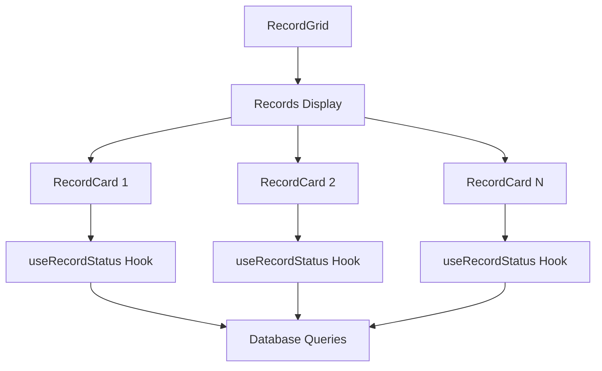

# Cart & Reservation System Implementation Guide - Part 1 (Revised): Codebase Analysis & Core Changes

## Overview

The goal of this feature is to allow the Cart functionality and implementation of a reservation system with queue management that that enforces the reservation policy. 

## Current Architecture Analysis

### Database Schema (from SRS)
```sql
-- Core Tables & Status Types
CREATE TABLE cart_items (
    id uuid primary key default gen_random_uuid(),
    user_alias text references users(alias),
    release_id integer references releases(id),
    status text check (status in ('AVAILABLE', 'RESERVED_BY_OTHERS', 'IN_QUEUE')),
    last_validated_at timestamptz default now()
);

CREATE TABLE reservations (
    id uuid primary key default gen_random_uuid(),
    release_id integer references releases(id),
    user_alias text references users(alias),
    status text check (status in ('RESERVED', 'SOLD')),
    expires_at timestamptz default now() + interval '7 days'
);

-- Key Triggers
- cart_item_validation: Validates cart status
- handle_reservation_expiry: Manages expiration
- maintain_queue_order: Manages queue positions
```

### Current Status Management Issues


Problems:
1. Multiple Requests:
   - One query per record for status
   - Separate subscription per record
   - Redundant validations

2. Status Management:
   - Not using existing triggers
   - Inefficient status checks
   - Complex UI state derivation

## Implementation Changes

### 1. Type System Update
```typescript
// src/types/database.ts

// Actual status types from database
export type CartItemStatus = 'AVAILABLE' | 'RESERVED_BY_OTHERS' | 'IN_QUEUE';
export type ReservationStatus = 'RESERVED' | 'SOLD';

// Status with user context
export interface RecordStatus {
  cartStatus: CartItemStatus;
  reservation: {
    status: ReservationStatus | null;
    user_alias: string | null;
  } | null;
  queuePosition?: number;
  lastValidated: string;
}

// Status with derived UI state
export interface RecordUIState {
  isReservedByMe: boolean;
  canAddToCart: boolean;
  canJoinQueue: boolean;
  showQueuePosition: boolean;
}
```

### 2. Optimized Status Management
```typescript
// src/hooks/useRecordStatus.ts
export function useRecordStatus(recordIds: number[]) {
  const [statuses, setStatuses] = useState<Record<number, RecordStatus>>({});
  const supabase = createClientComponentClient();
  const { session } = useSession();

  const fetchStatuses = async () => {
    if (!recordIds.length) return;

    // Single query for all reservations
    const { data: reservations } = await supabase
      .from('reservations')
      .select('release_id, status, user_alias')
      .in('release_id', recordIds)
      .eq('status', 'RESERVED');

    // Get cart statuses (validated by trigger)
    const { data: cartItems } = await supabase
      .from('cart_items')
      .select('release_id, status, last_validated_at')
      .in('release_id', recordIds)
      .eq('user_alias', session?.user_alias);

    // Build status map using existing database states
    const newStatuses = recordIds.reduce((acc, id) => {
      const reservation = reservations?.find(r => r.release_id === id);
      const cartItem = cartItems?.find(c => c.release_id === id);

      acc[id] = {
        cartStatus: cartItem?.status || 'AVAILABLE',
        reservation: reservation ? {
          status: reservation.status,
          user_alias: reservation.user_alias
        } : null,
        lastValidated: cartItem?.last_validated_at || new Date().toISOString()
      };
      return acc;
    }, {} as Record<number, RecordStatus>);

    setStatuses(newStatuses);
  };

  // ... subscription and effect code
}
```

### 3. Status Utils
```typescript
// src/utils/status.ts
export function getActionState(status: RecordStatus, currentUserAlias: string | null) {
  return {
    canAddToCart: status.cartStatus === 'AVAILABLE',
    canJoinQueue: status.cartStatus === 'RESERVED_BY_OTHERS' && 
                  status.reservation?.user_alias !== currentUserAlias,
    showQueuePosition: status.cartStatus === 'IN_QUEUE'
  };
}
```

### 4. Component Updates

#### ActionButton Enhancement
```typescript
// src/components/records/ActionButton.tsx
export const ActionButton = memo(function ActionButton({
  recordId,
  status,
  className
}: ActionButtonProps) {
  const { session } = useSession();
  const actionState = getActionState(status, session?.user_alias);

  if (actionState.showQueuePosition) {
    return (
      <Button disabled className={className}>
        <Clock className="mr-2 h-4 w-4" />
        Queue Position {status.queuePosition}
      </Button>
    );
  }

  if (actionState.canJoinQueue) {
    return (
      <Button onClick={handleJoinQueue} className={className}>
        <Users className="mr-2 h-4 w-4" />
        Join Queue
      </Button>
    );
  }

  return (
    <Button 
      onClick={handleAddToCart}
      disabled={!actionState.canAddToCart}
      className={className}
    >
      <ShoppingCart className="mr-2 h-4 w-4" />
      Add to Cart
    </Button>
  );
});
```

# Cart & Reservation System Implementation Guide - Part 2 (Revised): Cart & Reservation Implementation

## Cart Store Implementation

### Cart Store with Database States
```typescript
// src/store/cartSlice.ts
import { StateCreator } from 'zustand';
import { CartItemStatus } from '@/types/database';

interface CartState {
  items: CartItem[];
  isOpen: boolean;
  isLoading: boolean;
  error: string | null;
  lastValidated: string;
}

interface CartActions {
  addItem: (recordId: number) => Promise<void>;
  removeItem: (recordId: number) => Promise<void>;
  clearCart: () => Promise<void>;
  setOpen: (open: boolean) => void;
  validateItems: () => Promise<void>;
}

export const createCartSlice: StateCreator<CartState & CartActions> = (set, get) => ({
  items: [],
  isOpen: false,
  isLoading: false,
  error: null,
  lastValidated: new Date().toISOString(),

  addItem: async (recordId) => {
    set({ isLoading: true, error: null });
    try {
      // Let cart_item_validation trigger handle the status
      const { data, error } = await supabase
        .from('cart_items')
        .insert({
          release_id: recordId,
          user_alias: get().session?.user_alias,
          status: 'AVAILABLE' // Initial status, trigger will validate
        })
        .select('*, releases(*)') // Include record details
        .single();

      if (error) throw error;

      set(state => ({
        items: [...state.items, data],
        isLoading: false,
        lastValidated: new Date().toISOString()
      }));
    } catch (err) {
      set({ error: 'Failed to add item to cart', isLoading: false });
    }
  },

  validateItems: async () => {
    // Cart validation is automatic through trigger
    // Just fetch latest state
    const { data: validatedItems, error } = await supabase
      .from('cart_items')
      .select('*, releases(*)')
      .eq('user_alias', get().session?.user_alias);

    if (error) {
      set({ error: 'Failed to validate cart' });
      return;
    }

    set({
      items: validatedItems,
      lastValidated: new Date().toISOString()
    });
  }
});
```

## Cart Operations

### Cart Hook with Real-time Updates
```typescript
// src/hooks/useCart.ts
export function useCart() {
  const { session } = useSession();
  const store = useStore();
  
  // Subscribe to cart_items changes
  useEffect(() => {
    if (!session?.user_alias) return;

    // Listen for cart item status changes
    const subscription = supabase
      .channel('cart-status')
      .on(
        'postgres_changes',
        {
          event: '*',
          schema: 'public',
          table: 'cart_items',
          filter: `user_alias=eq.${session.user_alias}`
        },
        (payload) => {
          // Status is managed by trigger, just refresh our state
          store.validateItems();
        }
      )
      .subscribe();

    return () => {
      subscription.unsubscribe();
    };
  }, [session?.user_alias]);

  // Expose cart operations
  return {
    items: store.items,
    isOpen: store.isOpen,
    setOpen: store.setOpen,
    addToCart: store.addItem,
    removeFromCart: store.removeItem,
    validateCart: store.validateItems,
    isLoading: store.isLoading,
    error: store.error
  };
}
```

### Reservation Hook
```typescript
// src/hooks/useReservations.ts
export function useReservations() {
  const { session } = useSession();
  const supabase = createClientComponentClient();

  const createReservation = useCallback(async (recordId: number) => {
    if (!session?.user_alias) return;

    try {
      // Direct insert, expiration handled by trigger
      const { error } = await supabase
        .from('reservations')
        .insert({
          release_id: recordId,
          user_alias: session.user_alias,
          status: 'RESERVED'
        });

      if (error) throw error;
    } catch (err) {
      console.error('Failed to create reservation:', err);
      throw err;
    }
  }, [session?.user_alias]);

  const joinQueue = useCallback(async (recordId: number) => {
    if (!session?.user_alias) return;

    try {
      // Direct insert, position handled by maintain_queue_order trigger
      const { error } = await supabase
        .from('reservation_queue')
        .insert({
          release_id: recordId,
          user_alias: session.user_alias
        });

      if (error) throw error;
    } catch (err) {
      console.error('Failed to join queue:', err);
      throw err;
    }
  }, [session?.user_alias]);

  return {
    createReservation,
    joinQueue
  };
}
```

## Cart UI Components

### Cart Sheet
```typescript
// src/components/cart/CartSheet.tsx
export function CartSheet() {
  const { items, isOpen, setOpen, validateCart } = useCart();
  const { t } = useTranslation();

  useEffect(() => {
    if (isOpen) {
      validateCart();
    }
  }, [isOpen]);

  const calculateTotal = () => 
    items.reduce((sum, item) => sum + (item.releases?.price || 0), 0);

  return (
    <Sheet open={isOpen} onOpenChange={setOpen}>
      <SheetContent>
        <SheetHeader>
          <SheetTitle>{t('cart.title')}</SheetTitle>
          <SheetDescription>
            {items.length 
              ? t('cart.itemCount', { count: items.length })
              : t('cart.empty')
            }
          </SheetDescription>
        </SheetHeader>

        <div className="space-y-4 mt-4">
          {items.map(item => (
            <CartItem key={item.id} item={item} />
          ))}
        </div>

        {items.length > 0 && (
          <div className="mt-6 space-y-4">
            <div className="flex justify-between font-semibold">
              <span>{t('cart.total')}</span>
              <span>{formatPrice(calculateTotal())}</span>
            </div>
            <Button 
              className="w-full" 
              onClick={handleCheckout}
            >
              {t('cart.checkout')}
            </Button>
          </div>
        )}
      </SheetContent>
    </Sheet>
  );
}
```

### Cart Item Component
```typescript
// src/components/cart/CartItem.tsx
export function CartItem({ item }: { item: CartItem }) {
  const { removeFromCart } = useCart();

  return (
    <div className="flex items-start gap-4 p-4 bg-card rounded-lg">
      <div className="flex-1 min-w-0">
        <p className="font-medium truncate">
          {item.releases?.title}
        </p>
        <p className="text-sm text-muted-foreground">
          {formatPrice(item.releases?.price || 0)}
        </p>
        <div className="mt-2">
          <Badge variant={getStatusVariant(item.status)}>
            {item.status}
          </Badge>
        </div>
      </div>

      <Button
        variant="ghost"
        size="sm"
        onClick={() => removeFromCart(item.id)}
      >
        <X className="h-4 w-4" />
      </Button>
    </div>
  );
}

const getStatusVariant = (status: CartItemStatus) => {
  switch (status) {
    case 'AVAILABLE': return 'default';
    case 'RESERVED_BY_OTHERS': return 'secondary';
    case 'IN_QUEUE': return 'outline';
    default: return 'default';
  }
};
```

# Cart & Reservation System Implementation Guide - Part 3 (Revised): Checkout, Testing & Error Handling

## Checkout Integration

### WhatsApp Message Formatting
```typescript
// src/lib/checkout.ts
interface CheckoutItem {
  title: string;
  catno: string;
  price: number;
}

export function formatWhatsAppMessage(items: CheckoutItem[], userAlias: string): string {
  const formattedItems = items
    .map(item => `- ${item.title} [${item.catno}] (${formatPrice(item.price)})`)
    .join('\n');

  const total = items.reduce((sum, item) => sum + item.price, 0);

  return `Hi! I would like to pick up:
${formattedItems}
Total: ${formatPrice(total)}
Alias: ${userAlias}`;
}
```

### Checkout Handler
```typescript
// src/hooks/useCheckout.ts
export function useCheckout() {
  const { items } = useCart();
  const { session } = useSession();

  const handleCheckout = useCallback(async () => {
    if (!items.length || !session?.user_alias) return;

    try {
      // Format items for message
      const checkoutItems = items.map(item => ({
        title: item.releases.title,
        catno: item.releases.labels[0].catno,
        price: item.releases.price
      }));

      // Generate WhatsApp message
      const message = formatWhatsAppMessage(checkoutItems, session.user_alias);
      
      // Open WhatsApp
      const whatsappUrl = `https://wa.me/${process.env.NEXT_PUBLIC_WHATSAPP_NUMBER}?text=${encodeURIComponent(message)}`;
      window.open(whatsappUrl, '_blank');

    } catch (error) {
      console.error('Checkout failed:', error);
    }
  }, [items, session?.user_alias]);

  return {
    handleCheckout,
    canCheckout: items.length > 0 && !!session?.user_alias
  };
}
```

## Error Handling System

### Error Types
```typescript
// src/lib/errors.ts
export class CartOperationError extends Error {
  constructor(
    message: string,
    public code: 'VALIDATION' | 'RESERVATION' | 'QUEUE' | 'NETWORK',
    public context?: any
  ) {
    super(message);
    this.name = 'CartOperationError';
  }
}

export class ReservationError extends Error {
  constructor(
    message: string,
    public code: 'ALREADY_RESERVED' | 'QUEUE_FULL' | 'EXPIRED',
    public context?: any
  ) {
    super(message);
    this.name = 'ReservationError';
  }
}
```

### Error Handlers
```typescript
// src/lib/error-handlers.ts
export const handleCartError = (error: unknown): string => {
  if (error instanceof CartOperationError) {
    switch (error.code) {
      case 'VALIDATION':
        return 'Item status has changed. Please try again.';
      case 'RESERVATION':
        return 'This item is no longer available.';
      case 'QUEUE':
        return 'Unable to join queue. Please try again.';
      case 'NETWORK':
        return 'Network error. Please check your connection.';
    }
  }
  return 'An unexpected error occurred.';
};

export const handleReservationError = (error: unknown): string => {
  if (error instanceof ReservationError) {
    switch (error.code) {
      case 'ALREADY_RESERVED':
        return 'This item is already reserved.';
      case 'QUEUE_FULL':
        return 'The queue is currently full.';
      case 'EXPIRED':
        return 'The reservation has expired.';
    }
  }
  return 'Unable to process reservation.';
};
```

## Testing Suite

### Unit Tests
```typescript
// src/hooks/__tests__/useCart.test.ts
describe('useCart', () => {
  beforeEach(() => {
    // Mock Supabase client
  });

  it('should add item to cart', async () => {
    const { result } = renderHook(() => useCart());
    
    await act(async () => {
      await result.current.addToCart(1);
    });

    expect(result.current.items).toHaveLength(1);
    expect(result.current.items[0].status).toBe('AVAILABLE');
  });

  it('should handle validation trigger', async () => {
    const { result } = renderHook(() => useCart());
    
    // Mock trigger response
    mockSupabase.from('cart_items').insert().mockResolvedValueOnce({
      data: { status: 'RESERVED_BY_OTHERS' }
    });

    await act(async () => {
      await result.current.addToCart(1);
    });

    expect(result.current.items[0].status).toBe('RESERVED_BY_OTHERS');
  });
});

// src/hooks/__tests__/useCheckout.test.ts
describe('useCheckout', () => {
  it('should format WhatsApp message correctly', () => {
    const items = [
      { title: 'Test Record', catno: 'TEST-1', price: 10 }
    ];
    
    const message = formatWhatsAppMessage(items, 'testUser');
    
    expect(message).toContain('Test Record [TEST-1] (10€)');
    expect(message).toContain('Alias: testUser');
  });
});
```

### Integration Tests
```typescript
// src/components/__tests__/cart.integration.test.ts
describe('Cart Integration', () => {
  it('should handle complete cart flow', async () => {
    const { getByText, queryByText } = render(<CartSheet />);
    
    // Add item
    await userEvent.click(getByText('Add to Cart'));
    
    // Validate trigger effects
    await waitFor(() => {
      expect(queryByText('AVAILABLE')).toBeInTheDocument();
    });
    
    // Simulate reservation by other user
    await mockReservationTrigger(1, 'otherUser');
    
    // Check status update
    await waitFor(() => {
      expect(queryByText('RESERVED_BY_OTHERS')).toBeInTheDocument();
    });
  });
});
```

### E2E Tests
```typescript
// cypress/e2e/cart.cy.ts
describe('Cart & Checkout Flow', () => {
  beforeEach(() => {
    cy.login();
    cy.visit('/');
  });

  it('completes checkout process', () => {
    // Add to cart
    cy.get('[data-testid="add-to-cart-button"]').first().click();
    
    // Open cart
    cy.get('[data-testid="cart-button"]').click();
    
    // Verify cart item
    cy.get('[data-testid="cart-item"]').should('have.length', 1);
    
    // Start checkout
    cy.get('[data-testid="checkout-button"]').click();
    
    // Verify WhatsApp URL
    cy.url().should('include', 'wa.me');
  });

  it('handles reservation conflicts', () => {
    // Add to cart
    cy.get('[data-testid="add-to-cart-button"]').first().click();
    
    // Simulate other user reserving
    cy.task('createReservation', {
      recordId: 1,
      userAlias: 'otherUser'
    });
    
    // Verify status update
    cy.get('[data-testid="cart-item-status"]')
      .should('have.text', 'RESERVED_BY_OTHERS');
    
    // Verify queue option
    cy.get('[data-testid="join-queue-button"]')
      .should('be.visible');
  });
});
```
